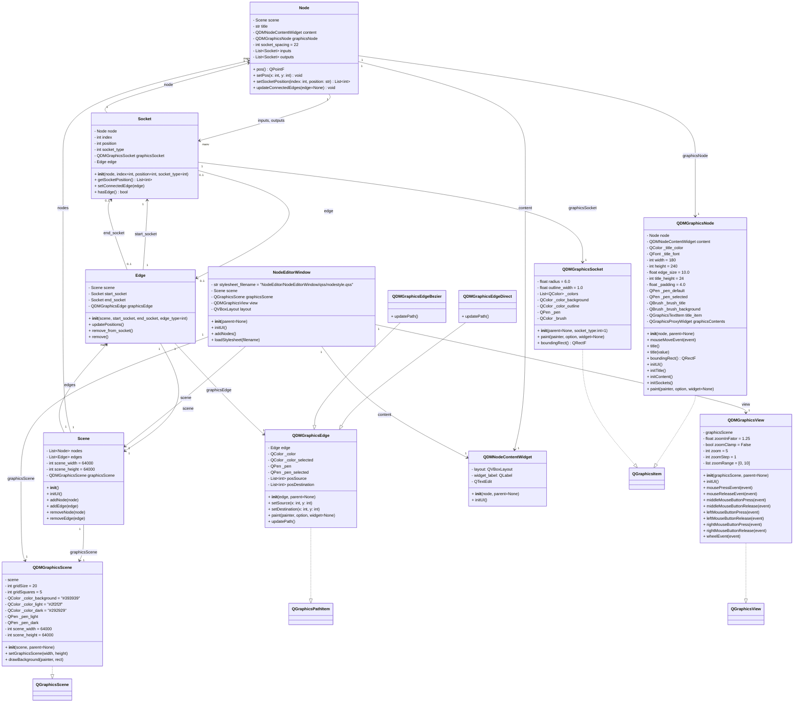

# ManimCE Node Editor — Visual Animation Creator

A PyQt5-based visual node editor designed to **simplify the creation of ManimCE animation videos**.  
This tool enables intuitive construction of animation sequences using nodes and connections, turning complex Manim scripting into a visual workflow.

---

## Project Goals & Progress

### ✅ Current Progress by Milestone

| Milestone                                            | Progress |
|-----------------------------------------------------|----------|
| 1. Basic Node Editor Features                        | 66%      |
| 2. Advanced Node Editor Features                     | 0%       |
| 3. Node Editor Packaging                             | 0%       |
| 4. Node Editor Embedded Window Integration           | 0%       |
| 5. Completion of Node Editor                         | 0%       |
| 6. Applying Multiple Styles for UI Design            | 0%       |
| 7. Basic Integration with ManimCE Logic              | 0%       |
| 8. Advanced Integration with ManimCE Logic           | 0%       |
| 9. Export as Standalone Application (APP/EXE)        | 0%       |
| 10. Dedicated Tutorial Website and Documentation (Bilingual) | 0%       |

---

## 🚀 Key Features

- Modular architecture with clear separation between core logic, graphics, and UI components  
- Color-coded socket types for intuitive connections  
- Smooth edge rendering supporting both Bezier curves and direct lines  
- Live edge updates upon node movement for seamless interaction  
- Configurable logging system with console and optional file outputs for easier debugging  

---

## 📂 Project Structure



---

## 📺 Getting Started
```bash
git clone https://github.com/yourname/manimce-node-editor.git
cd manimce-node-editor
python -m venv .venv
source .venv/bin/activate  # Windows: .venv\Scripts\activate
pip install -r requirements.txt
python NodeEditor/node_editor_main.py
```

## 🎓 Learning Resources
* Official tutorial website coming soon, featuring detailed guides in both Chinese and English.

## 📄 License
[MIT License](./LICENSE)

## Additional suggestions:
* Add a "Contributing" section if you plan to open source or accept contributions.
* Add badges (build status, PyPI version, license) if you host the repo on GitHub.
* Add screenshots or GIFs of the editor UI to showcase it visually.
* Consider adding a "Known Issues" or "Roadmap" section for transparency.